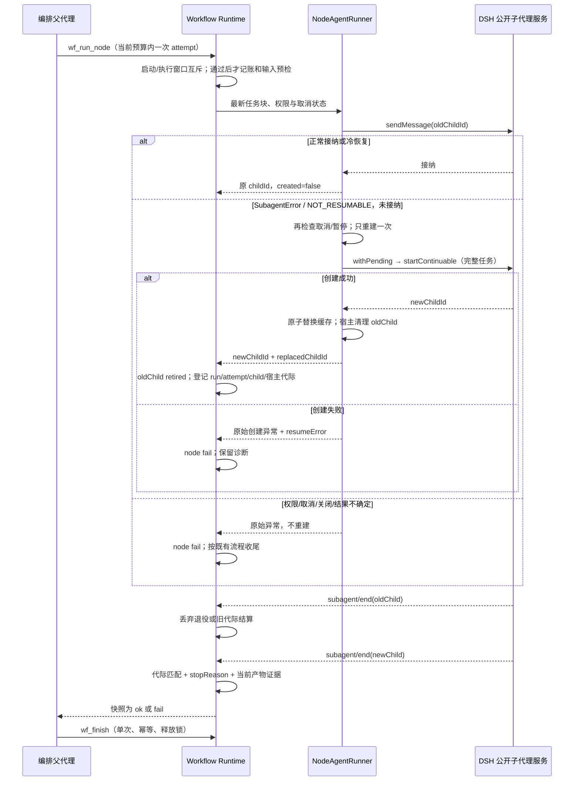

# PR #8：输入、子代理恢复与业务结算

基线为 PR #7 合并后的 `main`（`fdc1b33`）。本修复面向 DSH `0.1.6-alpha.2` / Node.js 22，保留新版 `acquireScope()` 和旧版 `standingKeyFor()`。插件版本为 `0.10.1`。不修改官方 DSH 源码、数据库或 Dify 导入业务。

## 故障与修复路径

首次 `load_data` 子代理结束并请求上传 CSV，不能据此判断销售数据读取完成。测试流程声明 `output/raw.json` 等五个产物，结算时核对文件可读性与该 attempt 开始前的基线；缺失或未发生本次写入时分别记录 `WF_OUTPUT_FILE_MISSING` / `WF_OUTPUT_FILE_STALE`。自由文本 schema 和没有声明产物的普通节点保持兼容。

文件节点必须通过既有 `fileBindings` 或受管文件配置提供输入。启动运行和节点派发前分别检查绑定、实际会话 cwd、授权和可读性，验证后的路径进入任务块。用户上传附件只表示宿主接纳了附件，仍需显式绑定文件节点，再启动新运行。多个 CSV 不自动选择；无绑定不会让模型搜索目录。附件的宿主授权检查和子代理文件工具的真实访问能力仍是两项检查，本次没有实际工具访问失败的证据，因此未增加暂存协议。

可正常延续的 child 继续通过公开 `sendMessage(parent, childId, blocks, { signal })` 派发。只有 Error 实例、异常名称 `SubagentError`、稳定代码 `NOT_RESUMABLE` 同时匹配，并且没有已接纳标记时，才允许一次重建。旧版公开实现的该错误发生在持久会话读取或 materialize 恢复阶段，早于 inbox 接纳。仅匹配 `unavailable` 文字、普通对象、权限拒绝、取消、关闭、缺少服务或结果不确定的异常均不重建；旧 `queuePrompt` 兜底不套用这个保证。

首次创建、配置变化和不可恢复重建共用 `createNodeChild()`，保留工具与 Prompt 的 `withPending()` 创建窗口、隔离 provider、模型配置和完整最新任务块。成功才切换缓存；失败保留旧缓存、原始创建异常、投递异常及脱敏诊断，不循环。每次重建仍属于当前 `wf_run_node` 的一个 attempt，不绕过 retryLimit 或总调用上限。取消信号与暂停状态在重建前再次核对。

同节点和 proxy 共享主节点的启动窗口与执行窗口互斥。返回 `started` 后，如果节点仍为 `running` 且对应当前 Workflow runId/attempt/childId 的有效 child 仍在 inflight，再次调度返回 `WF_BUSY`，不增加 callCount/attempts，不调用 `sendMessage` 或创建新 child。有效成功或失败结算完成后，允许在既有 retryLimit 内重试；产物验证尚未完成或收到旧宿主代际通知时仍忙碌。停止清除原运行 inflight，暂停中的 child 仍可正常结算，断点恢复沿用新 run 接管规则；退役或旧运行/attempt 登记不构成当前节点的忙碌依据。未结算时修改节点配置也不能重复派发，须先结算或显式停止后恢复。

新 child 登记后旧 child 标记 retired 并从 inflight 移除，宿主清除记忆的工具/Prompt/模型。旧 Agent 已不可达时撤销作用域与护栏；仍在内存时保留已安装的权限和护栏，等官方 agent/disposed 事件再撤销，避免中断未完成时解除权限。普通结束只撤销已销毁的作用域，保留可延续状态。结算同时匹配 Workflow runId、attempt、childId，以及公开 `subagent/start` / `end` 的宿主驻留代际。官方事件的 runId 是驻留代际，不等于 Workflow runId；同 childId 冷恢复后也能拒绝旧代际结算。旧接口缺少字段时保留会话、当前 child 和 attempt 的兼容校验。无法仅凭缺少宿主代际的旧 payload 分辨同 ID 的两个驻留代际，不伪造该信息。

产物验证在代际副本上执行，提交前再次核对当前登记，防止异步检查期间重建导致旧结果回写。首建或冷恢复结束事件早于登记时有界缓冲，退役事件直接丢弃，不唤醒父代理。下游必需 ctx 检查上游完成状态；已有完成状态的声明产物也会重新核对可读性，其机器验证路径显式传入任务块。



## 现场输入配置

本节描述原有销售测试的 file-node/explicit 配置。PR #9 增加了通用 RuntimeInputs 和可选自动交接：普通角色可以直接绑定运行输入，不必增加 File Node 或 ctx；静态契约、授权、迁移、工作台操作和两种现场验收命令见 [runtime-inputs.md](runtime-inputs.md)。未启用新策略的旧工作流继续使用下述语义。

没有声明文件输入要求、也没有连接文件输入节点的普通节点，不会被强制检查 CSV。本修复不会把销售测试的输入约束应用到所有角色节点；自由文本 schema 保持原有兼容行为。

销售分析验收必须显式配置以下内容：

1. CSV 文件节点，例如 `csv`，使用既有受管文件配置，或在启动运行时提供 `fileBindings: { csv: ["容器内实际 CSV 路径"] }`。路径必须在当前会话中可读且获得现有授权。
2. `csv.ctx-out → load_data.ctx-in` 连线，以及各处理节点之间的 `ctx-out → ctx-in` 连线。流程 `flow` 连线用于调度顺序，本身不传递文件或上游产物。
3. 销售角色节点的 `data.execution.inputSource = "ctx"` 与 `data.execution.outputFiles`。五节点分别声明 `output/raw.json`、`output/quality.json`、`output/stats.json`、`output/summary.md`、`output/final_report.md`，由有效结算核对本次执行的实际产物；只写 Prompt 或自由文本 outputSchema 不替代这些机器可验证的声明。

附件上传不等于文件绑定。附件在宿主会话中出现后，仍须将其显式绑定到对应 CSV 文件节点，再启动或按既有规则恢复运行。多个 CSV 由用户指定，不自动搜索目录、猜测 CSV 路径或选择附件。保留现有授权、工具白名单和 sandbox 检查；绑定成功也不代表子代理拥有超出既有权限的文件访问能力。`scripts/run-sales-live.mjs` 已配置上述节点、连线与产物声明，并通过 `SALES_CSV` 显式绑定输入。

## 文件说明

| 文件 | 修改目的 |
| --- | --- |
| `src/host/agent/runner.ts` | 公共创建流程、一次安全重建、投递互斥、取消/暂停检查、原始错误诊断及退役能力调用。 |
| `src/host/agent/model-selection.ts` | 明确退役时忘记模型路由，普通冷恢复保留。 |
| `src/host/visual-workflow-host.ts` | 宿主拥有退役清理；仅观察 Workflow child 的公开开始事件。 |
| `src/host/events.d.ts` | 声明公开开始事件的最小结构。 |
| `src/host/orchestrator/seams.ts` | 可选运行状态检查和执行/宿主代际字段，兼容原调用方。 |
| `src/host/orchestrator/run-entry.ts` | 非持久化的节点派发窗口登记。 |
| `src/host/orchestrator/runtime-base.ts` | 驻留代际事实及清理；退役 child 不再归属于当前运行。 |
| `src/host/orchestrator/runtime-execute.ts` | 同节点/proxy 去重、预算不变、组合取消信号、完整执行归属与启动失败 childId。 |
| `src/host/orchestrator/runtime-observe.ts` | 结算代际核对、有界早到缓冲、产物验证副本及提交前检查。 |
| `src/host/orchestrator/execution-inputs.ts` | 合法 ctx 来源检查、复用既有授权、下游重新核对上游产物。 |
| `src/host/orchestrator/graph-facts.ts` | 已验证输入路径与完成产物路径显式进入任务块。 |
| `src/host/prompts/orchestration.ts` | 输入绑定、业务完成证据与失败收尾在首段/末段重申；纯编排父代理不搜索或处理 CSV。 |
| `scripts/run-sales-live.mjs` | 保留可配置路由/地址/认证，进一步核对真实 raw/quality 中间产物。 |
| `package.json` | 修复版本 `0.10.1`，不添加运行时官方依赖。 |
| `tests/host/agent/{runner,model-selection}.test.ts` | 接纳边界、恢复、权限/Prompt/模型、并发、取消及清理。 |
| `tests/host/orchestrator/{runtime-execute,runtime-observe,execution-inputs}.test.ts` | 预算、运行锁、代际与输入/产物失败路径。 |
| `tests/host/prompts/orchestration.test.ts` | 经导出常量验证首段/末段约束与原字节稳定测试。 |
| `tests/integration/node-recovery.test.ts` | 真实 runner、runtime、创建窗口与存储协作；覆盖未结算忙碌、预算、主节点/proxy、结算后重试、停止/暂停恢复与安全重建；仅 DSH 传输使用替身。 |
| `tests/integration/run-sales-live.test.ts` | 受控 HTTP + 真实文件验证脚本拒绝不完整中间产物；不是模型 E2E。 |
| `tests/integration/host-assembly.test.ts` | 真实 Cordis 宿主装配，退役守卫撤销及新 child 权限仍有效。 |
| `tests/contract/package-contract.test.ts` | 新版本与原发布包结构契约。 |
| `lib/` | 由构建同步的 JS、source map 和类型声明，未手工修改。 |
| `docs/node-recovery.md` | 本说明、生命周期、测试与现场安装/E2E 操作。 |

生成文件逐项：

- `lib/agent/model-selection.js`：对应源码的构建JavaScript。
- `lib/agent/runner.js`：对应源码的构建JavaScript。
- `lib/orchestrator/execution-inputs.js`：对应源码的构建JavaScript。
- `lib/orchestrator/graph-facts.js`：对应源码的构建JavaScript。
- `lib/orchestrator/runtime-base.js`：对应源码的构建JavaScript。
- `lib/orchestrator/runtime-execute.js`：对应源码的构建JavaScript。
- `lib/orchestrator/runtime-observe.js`：对应源码的构建JavaScript。
- `lib/prompts/orchestration.js`：对应源码的构建JavaScript。
- `lib/types/agent/model-selection.d.ts`：对应源码的构建类型声明。
- `lib/types/agent/runner.d.ts`：对应源码的构建类型声明。
- `lib/types/orchestrator/run-entry.d.ts`：对应源码的构建类型声明。
- `lib/types/orchestrator/runtime-base.d.ts`：对应源码的构建类型声明。
- `lib/types/orchestrator/runtime-execute.d.ts`：对应源码的构建类型声明。
- `lib/types/orchestrator/runtime-observe.d.ts`：对应源码的构建类型声明。
- `lib/types/orchestrator/seams.d.ts`：对应源码的构建类型声明。
- `lib/types/prompts/orchestration.d.ts`：对应源码的构建类型声明。
- `lib/visual-workflow-host.js`：对应源码的构建JavaScript。

## 验证

实际验证环境：Node.js `22.23.3`，DSH 官方包独立安装，没有修改官方源码。所有受控测试都属于单元/集成验证，不是实际 Docker 模型 E2E。

| 验证 | 实际结果 |
| --- | --- |
| `pnpm check` | PASS；四个 TypeScript Program、194 个测试文件 / 2252 项测试、Host/Client 构建及 Client smoke。 |
| 独立 `pnpm build` | PASS；同步生成的 `lib/orchestrator/runtime-execute.js`，其余构建文件无额外差异。 |
| 执行/结算针对性回归 | PASS；19 个文件 / 256 项测试，其中真实 RuntimeExecute + NodeAgentRunner 集成文件共 11 项，新增 10 项。 |
| 恢复相关 V8 验证 | PASS；29 个文件 / 435 项测试。本次补充逻辑的可执行修改行覆盖 5/5（100%）；整个 PR 相对 main 的可执行修改行交集覆盖 131/132（99.24%）。排除纯类型及非可执行模板行，这是修改行口径，不是全仓或分支覆盖率。 |
| 官方 DSH `0.1.6-alpha.2` Scope smoke | PASS；`standingKeyFor()`，6 次实际 Preset 读取、15 次实际 Scope 工具执行、2 个公开恢复钩子检查。 |
| 官方 DSH `0.2.0-rc.2` Scope smoke | PASS；`acquireScope()`，同上。受控 `compat-probe` Preset，不冒充真实模型或 shipped standard E2E。 |
| npm tarball | PASS；`dsh-visual-workflow-0.10.1.tgz`，17,433,051 字节；版本、导出入口与全部 17 个修改的 lib 文件逐字节比对通过。 |
| 真实 Docker 五节点模型 E2E | **NOT RUN**；现场执行下节命令。 |

本次已生成 tarball 的 SHA256：`0cbed2fa5c044cc57f8d0c924f522e9254cfec94f76c691baf7717f402d23f47`。不同构建或 npm 打包版本可能生成不同 archive hash；现场仍需核对自己实际构建/安装的文件。全仓检查存在 Node.js SQLite 实验性提示及依赖 source map 警告，未导致检查失败。

关键测试名称：

- `test_rebuild_NOT_RESUMABLE_preserves_policy_prompt_model_blocks_and_cause`
- `test_reuse_ambiguous_accepted_delivery_does_not_duplicate_executor`
- `test_reuse_error_explicitly_accepted_does_not_rebuild_even_with_NOT_RESUMABLE`
- `test_rebuild_creation_failure_preserves_cache_and_causes_without_loop`
- `test_dispatch_concurrent_proxy_counts_one_attempt`
- `test_dispatch_%s_unsettled_child_is_busy_without_consuming_budget`
- `test_dispatch_%s_settlement_allows_cached_child_retry_within_budget`
- `test_dispatch_%s_and_%s_share_startup_and_execution_mutex`
- `test_dispatch_settlement_validation_pending_remains_busy_until_verified`
- `test_dispatch_stopped_checkpoint_resumes_without_stale_busy_and_rejects_old_epoch`
- `test_dispatch_paused_child_settles_and_checkpoint_retry_rebuilds_unrecoverable_child`
- `test_creation_cancelled_after_host_returns_interrupts_new_child_and_keeps_old_cache`
- `test_settlement_same_child_new_run_rejects_previous_host_epoch`
- `test_settlement_cold_reuse_end_before_registration_is_buffered_for_current_epoch`
- `test_settlement_resume_during_validation_discards_old_result`
- `test_inputs_authorized_unbound_attachment_does_not_infer_CSV`
- `test_settlement_upload_request_without_artifact_fails_and_blocks_ctx`
- `test_ctx_verified_artifact_paths_rechecked_before_dispatch_deleted_%s`
- `test_recovery_NOT_RESUMABLE_one_attempt_replaces_child_and_isolates_late_end`
- `test_host_rebuild_releases_retired_guards_and_observes_workflow_epochs_only`

真实 Docker 五节点模型 E2E：**NOT RUN**。云环境没有用户现场 DSH 部署、准确 provider 标识或可访问的内部模型配置。用户在本地部署完成验收，不作为本 PR 的前置条件。

## 打包、安装与版本校验

从本 PR 分支/合并提交的完整仓库构建。以下 tarball 命令不上传 npm；先安装仓库依赖并保持原锁文件，使用现有部署安装流程。

```bash
node --version
pnpm check
pnpm build
mkdir -p /tmp/dsh-pr8-artifacts
npm pack --pack-destination /tmp/dsh-pr8-artifacts
task_tarball=/tmp/dsh-pr8-artifacts/dsh-visual-workflow-0.10.1.tgz
sha256sum "$task_tarball"
tar -xOf "$task_tarball" package/package.json | node -e 'let x="";process.stdin.on("data",d=>x+=d);process.stdin.on("end",()=>{const p=JSON.parse(x);if(p.name!=="dsh-visual-workflow"||p.version!=="0.10.1")process.exit(1);console.log(p.name,p.version)})'
```

将 tarball 放入实际 DSH 容器可读位置，通过现场已有 tarball 安装流程装到实际 Web profile。公开 CLI 支持本地文件 specifier 的部署可执行：

```bash
dsh plugin --profile web add "file:$task_tarball"
```

确认加载的是这个文件的 SHA256 和 `0.10.1`，而非旧 tarball/旧 link。安装后按现场部署方式重新加载对应服务，并在安装目录 `package.json` 核对版本。DSH 本身保持 `0.1.6-alpha.2`；如果插件安装依赖解析失败，保留失败日志，不自行升级 DSH。脚本和测试 CSV 在完整仓库中，不包含于 npm tarball；将它们放到实际执行容器的仓库路径。

## Docker / 沙箱检查

`workspace-write` 找不到可用 backend 是宿主沙箱部署错误。文件工具与 Bash 可以使用不同的执行权限；文件授权通过不代表 Bash 可执行，也不代表所有绝对附件路径在子代理工具中可访问。

在实际容器中检查：

```bash
node --version
dsh --version
command -v bwrap
bwrap --version
uname -r
cat /proc/sys/user/max_user_namespaces
cat /proc/sys/kernel/unprivileged_userns_clone
```

不存在的 sysctl 项不代表必然失败，最终以宿主选择的 backend 与实际探测结果为准。有 bubblewrap 时，可在容器内对只读最小沙箱做探测：

```bash
bwrap --unshare-user --unshare-pid --ro-bind / / --proc /proc --dev /dev -- /bin/true
```

在 Docker 主机检查当前 Compose 配置和 DSH 容器安全设置：

```bash
docker compose config
docker inspect --format '{{json .HostConfig.SecurityOpt}} {{json .HostConfig.CapAdd}} {{json .HostConfig.Privileged}}' "$task_container"
```

结合宿主的 backend 探测日志检查 seccomp、AppArmor、user namespace、内核与 Docker 策略。不要据这个检查结果把沙箱改成 `danger-full-access`、关闭 guard 或启用无沙箱模式。本 PR 未改变任何沙箱配置；现场仍有该错误时报告真实失败，不能生成假的产物或宣布节点成功。

## 现场五节点 E2E

在 DSH 容器内、或共享完全相同工作区文件系统的机器上执行。只设置配置名称与路径，凭据继续留在 DSH 内部设置。`DSH_TEST_PROVIDER` 使用现场确认的准确 provider，不能根据模型名称推断为 ollama/openai。地址使用部署实际端点，不固定 `host.docker.internal:11434`。

```bash
export DSH_BASE_URL='实际 DSH Web 端点'
export DSH_TEST_PROVIDER='现场确认的 provider 标识'
export DSH_TEST_MODEL='qwen3:30b-instruct'
export DSH_TEST_WORKSPACE='/实际挂载工作区/一次全新的验收目录'
export SALES_CSV='/容器内完整仓库/tests/fixtures/sales_workflow_test.csv'
# 仅在该部署日志提供登录 token 时设置，不打印日志或 token；使用其他认证方式时按现场机制配置：
export DSH_WEB_LOG='/实际容器内 DSH Web 日志'
node scripts/run-sales-live.mjs --prepare-only
node scripts/run-sales-live.mjs
```

`--prepare-only` 不发起模型运行，也不代表 E2E 通过；后一条创建独立会话并显式绑定 CSV，输出 `live-flow.json` / `live-run.json` 和五个产物。五节点分别声明 `output/raw.json`、`quality.json`、`stats.json`、`summary.md`、`final_report.md`。脚本核对真实 child、route、attempt、artifacts 和中间/最终文件；预期 11 条原始记录、1 条完全重复、2 个空单元格、9 条有效记录，总销售额 15900，平均 1766.67，最大 S001/6000，最小 S010/200。失败时先看节点 `failure.phase/code` 与宿主日志，区分输入/权限/模型/沙箱原因。

现场还需验证缺少绑定时没有 `load_data` child、实际附件授权与工具读取、正常冷恢复、确实无法恢复时只创建一个新 child、取消/暂停时不重建。不要靠删除生产会话来制造故障；只在专用测试会话复现。失败后按提示单次 `wf_finish(status="failed")` 收尾，检查锁释放。
